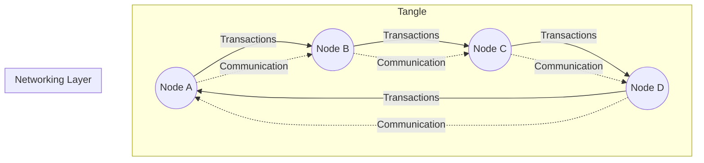
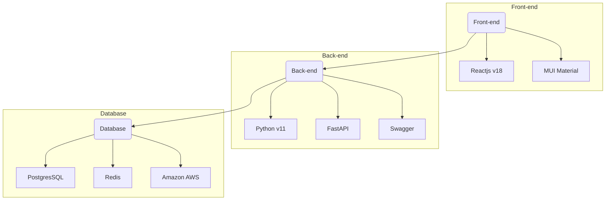
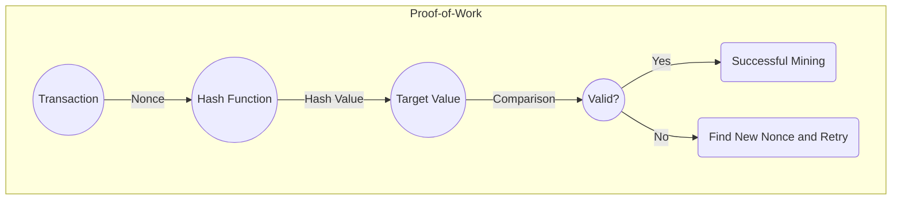

## Tangly (PoC Tangle Networking)


> Proof-of-Concept of a Tangle Networking


**Table of content:**
- [Tangly (PoC Tangle Networking)](#tangly-poc-tangle-networking)
- [What's Tangle?](#whats-tangle)
- [Stack](#stack)
- [Proof of Work](#proof-of-work)
- [Security](#security)
- [Validation](#validation)
- [License](#license)


 <!-- headings -->
 <a id="item-one"></a>
 ## What's Tangle?


  <a id="item-stack"></a>
 ## Stack


 
 <a id="item-two"></a>
 ## Proof of Work

 
 <a id="item-three"></a>
 ## Security
 ```mermaid
graph TD;
  subgraph Proof-of-Work;
    A[Double Spending Resistance] -->|Strengths| B[Computational Work];
    B -->|Weaknesses| C[51% Attack];
    D[Sybil Attacks] -->|Strengths| B;
    D -->|Weaknesses| E[Centralization];
    F[Energy Consumption] -->|Strengths| B;
    F -->|Weaknesses| G[Environmental Concerns];
  end

  subgraph Tangle;
    H[Double Spending Resistance] -->|Strengths| I[Asynchronous Transactions];
    I -->|Weaknesses| J[Parasitic Chain Attacks];
    K[Scalability] -->|Strengths| I;
    K -->|Weaknesses| L[Network Congestion];
  end;
```
### Proof-of-Work (PoW):

It covers aspects such as double-spending resistance, vulnerabilities to 51% attacks, susceptibility to Sybil attacks, and concerns related to energy consumption.

### Tangle:

It focuses on the strengths of Tangle, including its asynchronous transaction model, scalability benefits, and potential weaknesses, such as vulnerabilities to parasitic chain attacks and network congestion.


<a id="item-four"></a>
 ## Validation
 ```mermaid

graph TD;
  subgraph Transactions;
    A((Transaction 1)) -->|Approve| B((Transaction 2));
    B -->|Approve| C((Transaction 3));
    C -->|Approve| D((Transaction 4));
  end;

  subgraph Validators;
    E((Node E)) -->|Validate| B;
    F((Node F)) -->|Validate| C;
    G((Node G)) -->|Validate| D;
  end;

  subgraph Consensus;
    B -->|Consensus| H(Consensus Mechanism);
    C -->|Consensus| H;
    D -->|Consensus| H;
  end;

  subgraph Finality;
    H -->|Finality| I(Finalized Transaction);
  end;

```
### Transactions:
Transactions are linked together, with each transaction approving the previous one.

### Validators:
Nodes in the Tangle network (Node E, Node F, Node G) validate transactions by confirming their correctness and legitimacy.

### Consensus:
Transactions go through a consensus mechanism (represented by H) where nodes agree on the validity of transactions.

### Finality:
Once a transaction has gained sufficient approvals and has gone through the consensus process, it becomes finalized and considered valid (represented by I).

## License

Distributed under the MIT License. 
